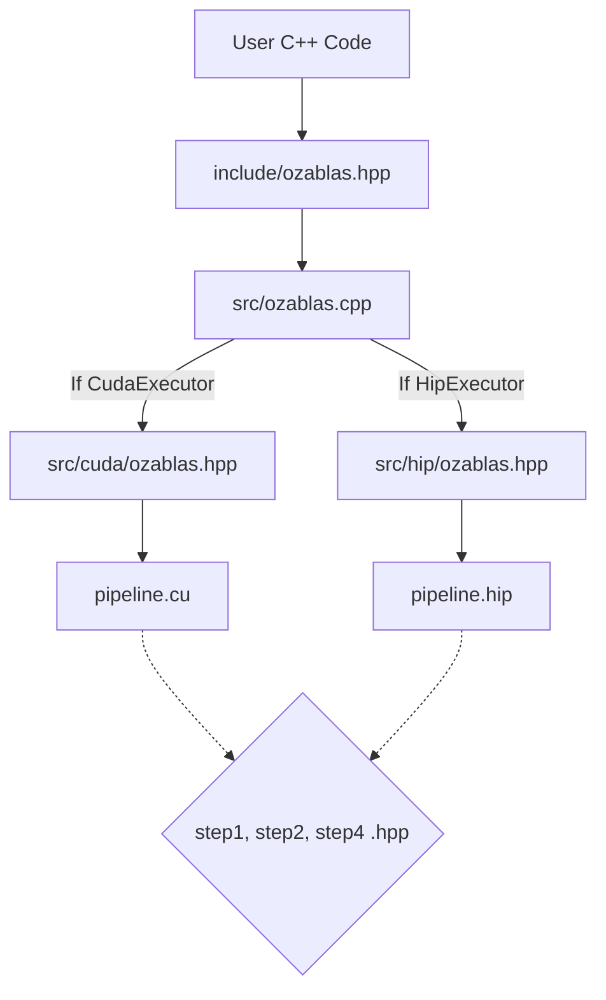

# OzaBLAS

OzaBLAS is a high-performance, multiplatform C++ library implementing Ozaki Scheme I (Sum and Scale) and Ozaki Scheme II (Chinese Remainder Theorem). 

## Algorithm Anatomy
OzaBLAS implements Ozaki Scheme I & II algorithms as four highly optimized pipeline stages, driving the $O(N^2)$ prep-work overhead down to near zero for large matrices.


## Getting Started

### Prerequisites
* **CMake 3.24+** (Required for native CUDA/HIP language support)
* **NVIDIA Toolkit** (for CUDA builds) or **AMD ROCm** (for HIP builds)
* A C++20 compatible host compiler (GCC/Clang/MSVC)

### Building the Project
We provide a convenience `Makefile` that wraps the CMake commands. By default, this compiles the library as a shared object (`libozablas.so`), along with the test suites and benchmark applications.

**To build for NVIDIA GPUs:**
```bash
make release-cuda
```

**To build for AMD GPUs:**

```bash
make release-hip
```

### Quick Start Example

OzaBLAS uses a unified API. You write your application code once, and simply swap the `Executor` to target different hardware. Here is how to multiply matrices on an AMD GPU using Ozaki Scheme II, while capturing pipeline step timings.

```cpp
#include <ozablas/ozablas.hpp>
#include <ozablas/core/executor.hpp>
#include <ozablas/core/workspace.hpp>
#include <iostream>

int main() {
    int M = 4096, N = 4096, K = 4096;
    int slices = 4; // Sweet-spot config for speed vs accuracy

    // 1. Initialize the hardware-specific executor (AMD HIP)
    auto exec = std::make_shared<ozablas::HipExecutor>(0);

    // ... [Assume device pointers d_A, d_B, d_C are allocated and populated here] ...

    // 2. Initialize the Workspace. 
    // This pre-allocates all memory and lazy-loads CRT tables to the GPU.
    ozablas::WorkspaceScheme2 ws(exec, M, N, K, slices);

    // 3. Setup optional timings struct to profile the pipeline
    ozablas::OzaTimings timings;

    // 4. Execute the Scheme II pipeline
    ozablas::ozaki_scheme2_gemm(ws, d_A, d_B, d_C, &timings);

    std::cout << "GEMM Math Time: " << timings.step3_ms << " ms\n";
    std::cout << "Total Pipeline Time: " << timings.total_ms << " ms\n";

    return 0;
}

```

## How It Works (Architecture)

A primary goal of OzaBLAS is providing a **hardware-agnostic user experience**. Users shouldn't need to write `.cu` or `.hip` code, nor should they have to manage platform-specific macros in their application logic.

To achieve this, the library utilizes a strict separation of concerns via a Dispatcher pattern:



### Why this design?

1. **Clean Public API:** The user only interacts with standard C++ headers (`include/`). All heavy hardware APIs (cuBLAS, rocBLAS) are hidden behind the polymorphic `Executor` class.
2. **Unified Math Kernels:** The actual math for the Ozaki schemes (Extracting exponents, modular slicing, CRT reconstruction) is written using shared `__device__` headers in `src/pipeline/`.
3. **Native Backend Compilation:** `pipeline.cu` and `pipeline.hip` are compiled natively by `nvcc` and `hipcc` respectively. They include the shared math headers, compile them into hardware-specific assembly, and execute the highly-optimized vendor BLAS APIs (Strided Batched Tensor Core ops) without cross-platform translation overhead.

## Project Structure

```shell
ozablas/
├── CMakeLists.txt                 # Root config: Detects hardware, sets up subdirectories.
├── include/ozablas/               # PUBLIC API (User includes these).
│   ├── core/
│   │   ├── executor.hpp           # Hardware memory managers (CPU, CUDA, HIP).
│   │   └── workspace.hpp          # Workspace buffers to prevent allocation overhead during execution.
│   └── ozablas.hpp                # Main API: ozaki_scheme1_gemm and ozaki_scheme2_gemm.
│
├── src/                           # PRIVATE IMPLEMENTATION (User never sees this).
│   ├── CMakeLists.txt             # Builds the libozablas.so shared library.
│   ├── ozablas.cpp                # The Dispatcher: Routes math ops to the correct GPU backend.
│   ├── core/
│   │   ├── executor.cpp           # Implements malloc/free routing.
│   │   └── workspace.cpp          # Size calculations and allocations for the workspaces.
│   ├── common/                    
│   │   ├── crt_tables.hpp         # Pure C++ constexpr arrays for Scheme II moduli and lookup tables.
│   │   └── crt_math.hpp           # Custom 256-bit struct and math logic for large slices.
│   ├── pipeline/                  # The 4 anatomical steps of the algorithm (Shared __device__ code).
│   │   ├── step1_statistics.hpp   
│   │   ├── step2_slicing.hpp      
│   │   └── step4_reconstruction.hpp  
│   ├── cuda/
│   │   ├── ozablas.hpp            # Bridge header for CUDA backend.
│   │   └── pipeline.cu            # NVIDIA __global__ launches & cuBLAS.
│   └── hip/
│       ├── ozablas.hpp            # Bridge header for HIP backend.
│       └── pipeline.hip           # AMD __global__ launches & rocBLAS.
│
├── utils/                         # NON-LIBRARY CODE: Utilities for testing.
│   ├── matrix_gen.hpp             # Implementation of matrix generation using the paper's exponential distribution.
│   ├── matrix_compare.hpp         # Mathematical error comparison logic.
│   └── matrix_io.hpp              # Console printing helpers.
│
├── tests/                         # GOOGLE TEST SUITE
│   ├── test_step1_stats.cpp       # Unit tests verifying exponent extraction.
│   ├── test_step2_slicing.cpp     # Unit tests verifying INT8 bit extraction and symmetric modulo logic.
│   ├── test_step4_crt.cpp         # Unit tests comparing 64-bit vs 256-bit CRT reconstruction.
│   └── test_integration.cpp       # End-to-end precision tests against standard double-precision BLAS.
│
├── performance_benchmarks/        # SPEED & THROUGHPUT PROFILING
│   ├── 01_ozaki_scheme1_2_raw_performance.cpp
│   ├── 02_ozaki_scheme2_pipeline_steps.cpp
│   ├── 03_ozaki_scheme1_pipeline_steps.cpp
│   └── CMakeLists.txt             
│
└── precision_benchmarks/          # ACCURACY VALIDATION & GROUND TRUTH
    ├── 01_ozaki_scheme2_example.cpp
    ├── 02_ozaki_scheme2_fp128_benchmark.cpp
    ├── 03_ozaki_scheme1_example.cpp
    ├── 04_ozaki_scheme1_fp128_benchmark.cpp
    └── CMakeLists.txt             

```

### Running Benchmarks

To evaluate the performance speedup or the exact precision error floor compared to a perfect FP128 software baseline, run the compiled benchmark executables:

```bash
# E.g., Testing FP128 baseline accuracy for Scheme II
./build_hip_release/precision_benchmarks/02_ozaki_scheme2_fp128_benchmark
```