# OzaBLAS

OzaBLAS is a high-performance, multiplatform C++ library implementing Ozaki Scheme I (Sum and Scale) and Ozaki Scheme II (Chinese Remainder Theorem). 

## Algorithm Anatomy
OzaBLAS implements Ozaki Scheme I & II algorithms as four highly optimized pipeline stages, driving the $O(N^2)$ prep-work overhead down to near zero for large matrices.

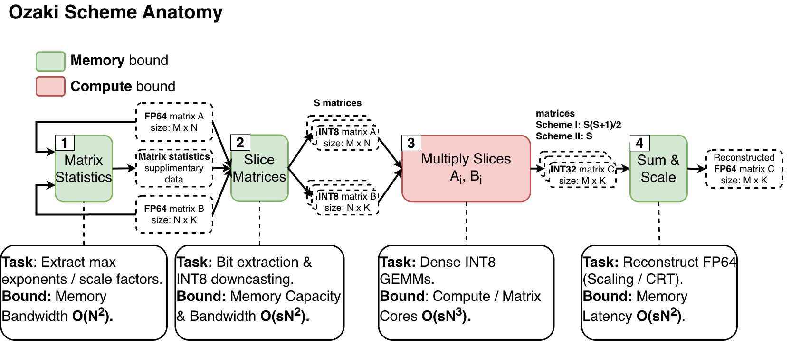

## Getting Started

### Prerequisites
* **CMake 3.24+** (Required for native CUDA/HIP language support)
* **NVIDIA Toolkit** (for CUDA builds) or **AMD ROCm** (for HIP builds)
* A C++20 compatible host compiler (GCC/Clang/MSVC)

### Building the Project
We provide a convenience `Makefile` that wraps the CMake commands. By default, this compiles the library as a shared object (`libozablas.so`), along with the test suites and benchmark applications.

**To build for NVIDIA GPUs:**
```bash
make release-cuda
```

**To build for AMD GPUs:**

```bash
make release-hip
```

### Quick Start Example

OzaBLAS uses a unified API. You write your application code once, and simply swap the `Executor` to target different hardware. This an example of matrix multiplication on an AMD GPU using Ozaki Scheme II, while capturing pipeline step timings.

```cpp
#include <ozablas/ozablas.hpp>
#include <ozablas/core/executor.hpp>
#include <ozablas/core/workspace.hpp>
#include <iostream>

int main() {
    int M = 4096, N = 4096, K = 4096;
    int slices = 4; // Defines accuracy

    // 1. Initialize the hardware-specific executor (AMD HIP)
    auto exec = std::make_shared<ozablas::HipExecutor>(0);

    // ... [Assume device pointers d_A, d_B, d_C are allocated and populated here] ...

    // 2. Initialize the Workspace. 
    // This pre-allocates all memory and lazy-loads CRT tables to the GPU.
    ozablas::WorkspaceScheme2 ws(exec, M, N, K, slices);

    // 3. Setup optional timings struct to profile the pipeline
    ozablas::OzaTimings timings;

    // 4. Execute the Scheme II pipeline
    ozablas::ozaki_scheme2_gemm(ws, d_A, d_B, d_C, &timings);

    std::cout << "GEMM Math Time: " << timings.step3_ms << " ms\n";
    std::cout << "Total Pipeline Time: " << timings.total_ms << " ms\n";

    return 0;
} 
```

## How It Works (Architecture)

A primary goal of OzaBLAS is providing a **hardware-agnostic user experience**. Users shouldn't need to write `.cu` or `.hip` code, nor should they have to manage platform-specific macros in their application logic.

To achieve this, the library utilizes a strict separation of concerns via a Dispatcher pattern:

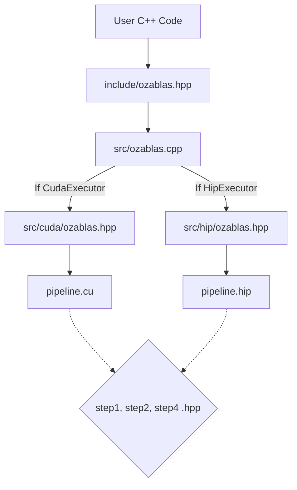

### Why this design?

1. **Clean Public API:** The user only interacts with standard C++ headers (`include/`). All heavy hardware APIs (cuBLAS, rocBLAS) are hidden behind the polymorphic `Executor` class.
2. **Unified Math Kernels:** The actual math for the Ozaki schemes (Extracting exponents, modular slicing, CRT reconstruction) is written using shared `__device__` headers in `src/pipeline/`.
3. **Native Backend Compilation:** `pipeline.cu` and `pipeline.hip` are compiled natively by `nvcc` and `hipcc` respectively. They include the shared math headers, compile them into hardware-specific assembly, and execute the highly-optimized vendor BLAS APIs (Strided Batched Tensor Core ops) without cross-platform translation overhead.

## Project Structure

```shell
ozablas/
├── CMakeLists.txt                 # Root config: Detects hardware, sets up subdirectories.
├── include/ozablas/               # PUBLIC API (User includes these).
│   ├── core/
│   │   ├── executor.hpp           # Hardware memory managers (CPU, CUDA, HIP).
│   │   └── workspace.hpp          # Workspace buffers to prevent allocation overhead during execution.
│   └── ozablas.hpp                # Main API: ozaki_scheme1_gemm and ozaki_scheme2_gemm.
│
├── src/                           # PRIVATE IMPLEMENTATION (User never sees this).
│   ├── CMakeLists.txt             # Builds the libozablas.so shared library.
│   ├── ozablas.cpp                # The Dispatcher: Routes math ops to the correct GPU backend.
│   ├── core/
│   │   ├── executor.cpp           # Implements malloc/free routing.
│   │   └── workspace.cpp          # Size calculations and allocations for the workspaces.
│   ├── common/                    
│   │   ├── crt_tables.hpp         # Pure C++ constexpr arrays for Scheme II moduli and lookup tables.
│   │   └── crt_math.hpp           # Custom 256-bit struct and math logic for large slices.
│   ├── pipeline/                  # The 4 steps of the algorithm (Shared __device__ code).
│   │   ├── step1_statistics.hpp   
│   │   ├── step2_slicing.hpp      
│   │   └── step4_reconstruction.hpp  
│   ├── cuda/
│   │   ├── ozablas.hpp            # Bridge header for CUDA backend.
│   │   └── pipeline.cu            # NVIDIA __global__ launches & cuBLAS.
│   └── hip/
│       ├── ozablas.hpp            # Bridge header for HIP backend.
│       └── pipeline.hip           # AMD __global__ launches & rocBLAS.
│
├── utils/                         # NON-LIBRARY CODE: Utilities for testing.
│   ├── matrix_gen.hpp             # Implementation of matrix generation using the paper's exponential distribution.
│   ├── matrix_compare.hpp         # Mathematical error comparison logic.
│   └── matrix_io.hpp              # Console printing helpers.
│
├── tests/                         # GOOGLE TEST SUITE
│   ├── test_step1_stats.cpp       # Unit tests verifying exponent extraction.
│   ├── test_step2_slicing.cpp     # Unit tests verifying INT8 bit extraction and symmetric modulo logic.
│   ├── test_step4_crt.cpp         # Unit tests comparing 64-bit vs 256-bit CRT reconstruction.
│   └── test_integration.cpp       # End-to-end precision tests against standard double-precision BLAS.
│
├── performance_benchmarks/        # SPEED & THROUGHPUT PROFILING
│   ├── 01_ozaki_scheme1_2_raw_performance.cpp
│   ├── 02_ozaki_scheme2_pipeline_steps.cpp
│   ├── 03_ozaki_scheme1_pipeline_steps.cpp
│   └── CMakeLists.txt             
│
└── precision_benchmarks/          # ACCURACY VALIDATION & GROUND TRUTH
    ├── 01_ozaki_scheme2_example.cpp
    ├── 02_ozaki_scheme2_fp128_benchmark.cpp
    ├── 03_ozaki_scheme1_example.cpp
    ├── 04_ozaki_scheme1_fp128_benchmark.cpp
    └── CMakeLists.txt
```

## Running Benchmarks

To evaluate the performance speedup or the exact precision error floor compared to a perfect FP128 software baseline, run the compiled benchmark executables:

```bash
# E.g., Testing FP128 baseline accuracy for Scheme II
./build_hip_release/precision_benchmarks/02_ozaki_scheme2_fp128_benchmark
```

### Performance Benchmarks (AMD MI210)

To understand the performance characteristics of OzaBLAS, we must first look at the theoretical hardware limits. On the AMD MI210, the peak FP64/FP32 Matrix throughput is **45.3 TFLOPS**, while the peak INT4/INT8 throughput is **181.0 TOPS**.

Because OzaBLAS breaks a single FP64 multiplication into multiple INT8 multiplications, we can determine our theoretical feasibility using the following equation:

$$k < \frac{P_{INT8}}{P_{FP64}} = \frac{181.0 \text{ TOPS}}{45.3 \text{ TFLOPS}} \approx 4$$

Where $k$ is the number of slices. To get a speedup $> 1$ over native FP64, we generally need to use fewer than 4 or 5 slices. Ultimately, it is a strict tradeoff: 
* **more slices** = better accuracy but worse performance
* **fewer slices** = worse accuracy but better performance

#### Raw Throughput (TFLOPS) vs. Matrix Size
As the matrix size increases, the heavy memory-bound prep work becomes negligible, allowing the INT8 Tensor Cores to overtake overall computation. For $S=3$ and $S=4$, OzaBLAS significantly outperforms native `rocBLAS` FP64 DGEMM (represented by the black dashed line).

| Scheme I (Sum and Scale) | Scheme II (CRT) |
| :---: | :---: |
| 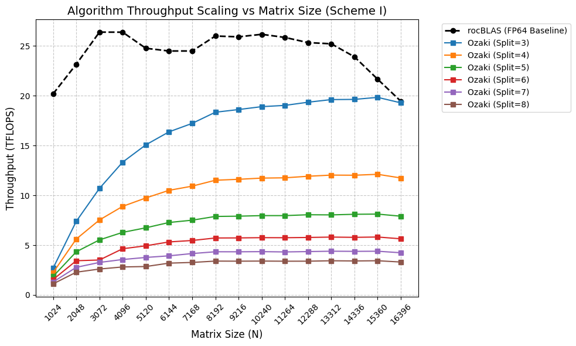 | 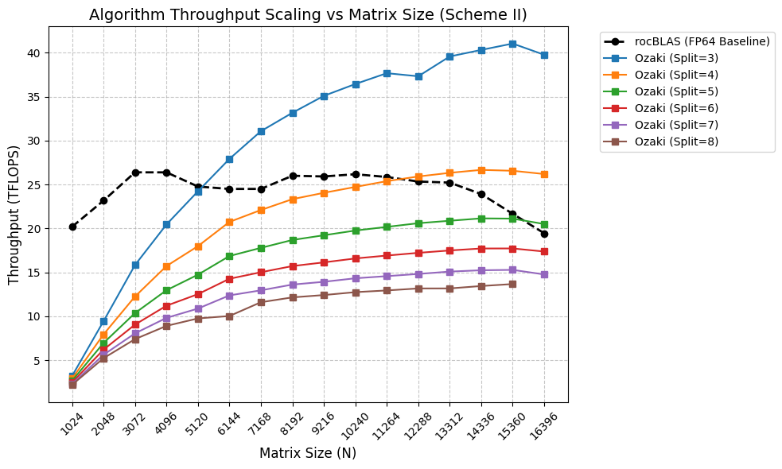 |

#### Throughput vs. Slice Count
This illustrates scaling of the two schemes. Scheme II scales linearly O(S) utilizing Strided Batched GEMMs, whereas Scheme I scales quadratically O(S^2) as it must compute the cross-terms of every slice combination.

| Scheme I | Scheme II |
| :---: | :---: |
| 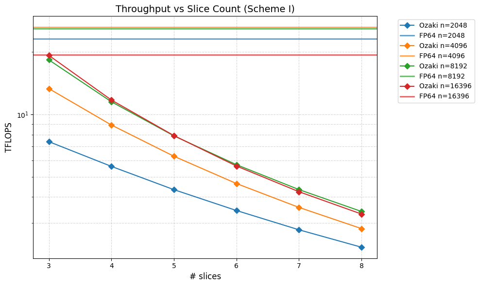 | 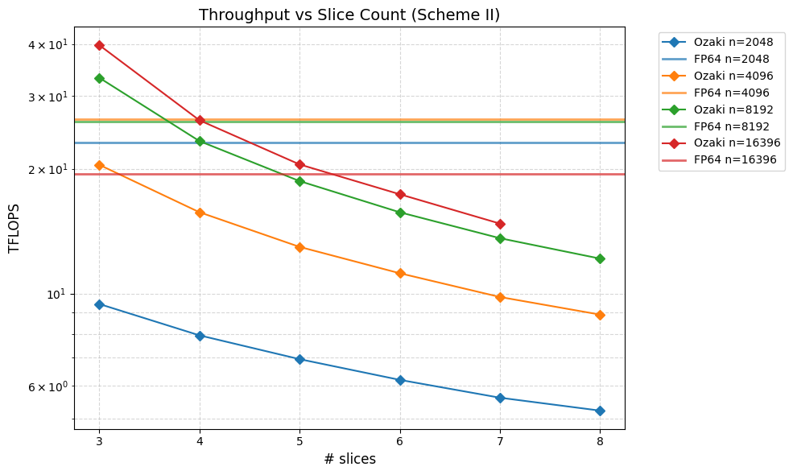 |

#### Pipeline Execution Time Breakdown
The core theoretical advantage of the Ozaki scheme is that computing matrix statistics and slicing and accumulation O(N^2) becomes mathematically insignificant compared to the actual GEMM multiplication O(N^3) as matrices grow large. These breakdowns prove that at large sizes ($N > 8192$), over 95% of the execution time is spent purely inside the Tensor Cores.

**Breakdown by Matrix Size:**

**Ozaki Scheme 1**
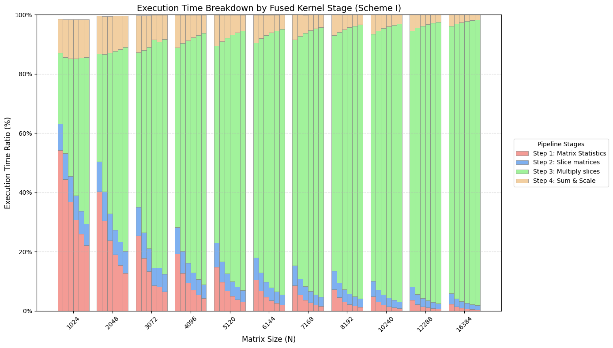

**Ozaki Scheme 2**
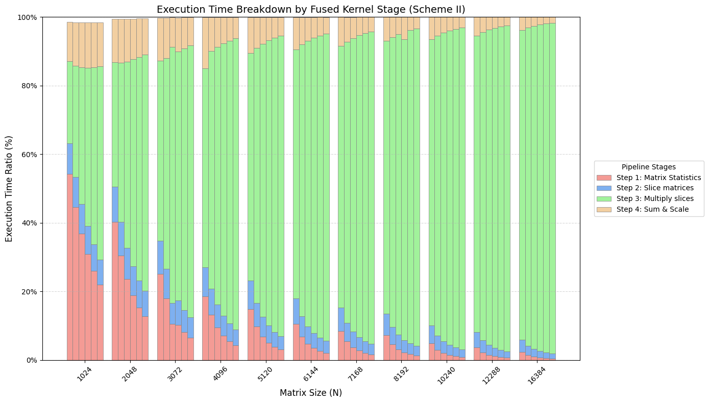

**Breakdown by Slice Count:**
**Ozaki Scheme 1**


**Ozaki Scheme 2**
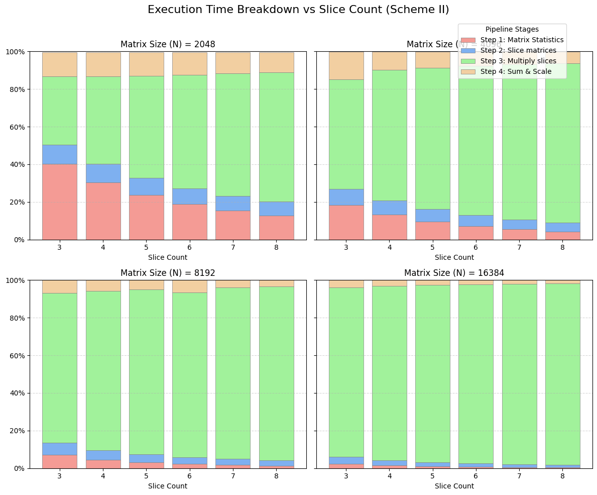

## Accuracy Validation

To validate the numerical stability of OzaBLAS, both schemes were evaluated against a mathematically perfect 128-bit precision (FP128) CPU baseline (implemented in utils/matrix_reference.hpp). The graphs below plot the worst-case maximum relative error against the slice count, tested across matrices with varying dynamic ranges ($\phi$).

*Note: These precision metrics were captured on an AMD Instinct MI210. Microscopic variations in the exact crossing points or error floors may occur across different hardware architectures (e.g., NVIDIA vs AMD) due to underlying differences in FMA instruction handling and reduction tree topologies.*

**Ozaki Scheme I:**
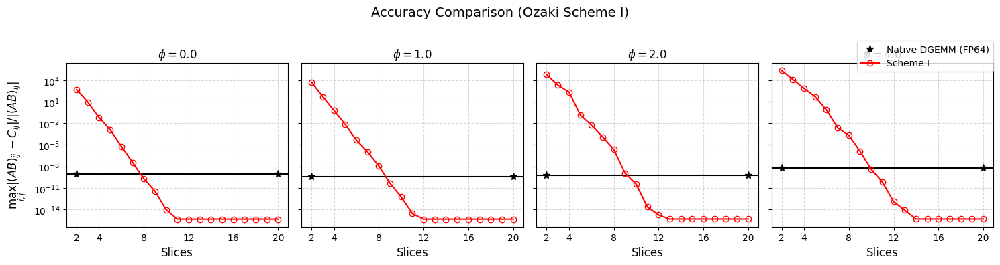

**Ozaki Scheme II:**
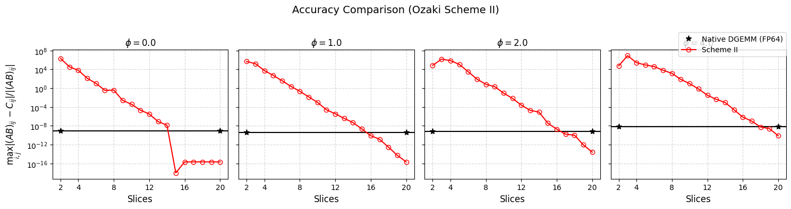

As demonstrated, both implementations successfully bypass vendor baselines (rocblas). As the slice count increases, both algorithms reliably cross the native `DGEMM` FP64 baseline (black line). Scheme I converges sharply to the machine epsilon floor ($\sim 10^{-16}$), while Scheme II utilizes the 256-bit extended precision fallback to maintain steady log-linear convergence even at extreme dynamic ranges ($\phi = 4.0$).
